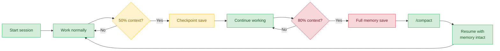
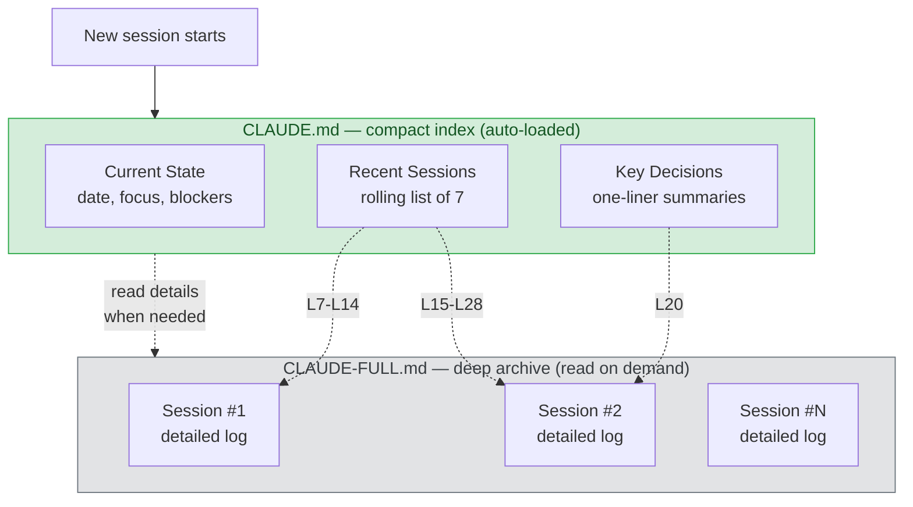
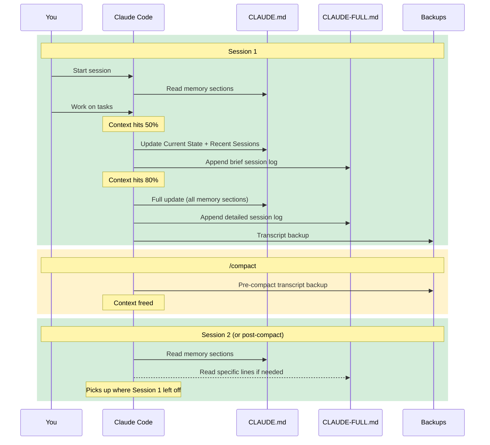
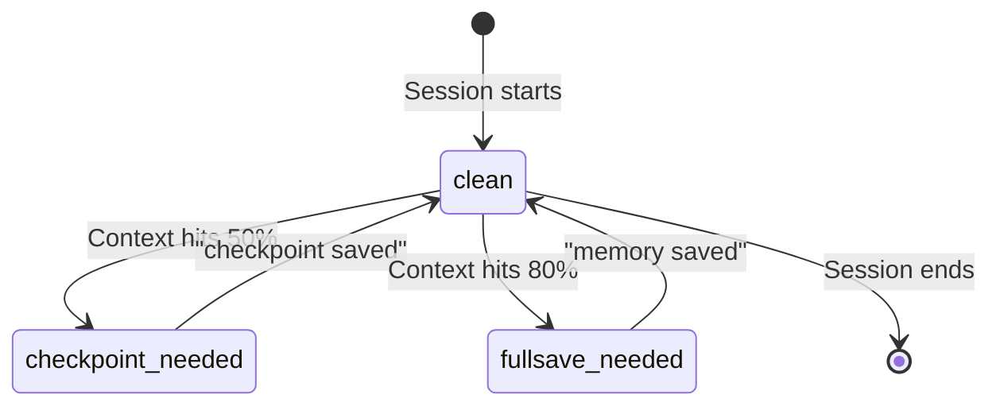

# mimo

Hook-based memory system for [Claude Code](https://docs.anthropic.com/en/docs/claude-code). Claude Code forgets everything between sessions — mimo fixes that with automatic checkpoints, a two-tier archive, and zero configuration.



## What it does

- **Automatic memory saves** — checkpoints at 50% context, full save at 80%. Claude writes session state to disk before context is lost, then resumes the interrupted task automatically
- **Two-tier archive** — compact index in `CLAUDE.md` (auto-loaded every session) + detailed logs in `CLAUDE-FULL.md` (read on demand)
- **Multi-project safe** — run 3+ Claude Code sessions simultaneously with fully isolated state per session
- **Zero configuration** — install once, start a session, mimo auto-initializes everything. Use `/save` anytime to save manually

## Quick start

1. Install mimo (one command)
2. `cd` into any project and start Claude Code
3. mimo auto-creates `CLAUDE.md` and `CLAUDE-FULL.md`
4. Work normally — the status bar tracks context usage with a colored progress bar
5. At 50%, Claude saves a checkpoint. At 80%, a full session log
6. Start a new session — Claude reads the memory sections and picks up where you left off
7. Use `/save` or `/save-full` anytime to save on demand

## Install

```bash
curl -fsSL https://raw.githubusercontent.com/ShivanDana/mimo/main/install.sh | bash
```

**Requirements:** `jq`, `bash` 3.2+, [Claude Code](https://docs.anthropic.com/en/docs/claude-code) installed

Verify the installation:

```bash
mimo status
```

## How it works

### Two-tier memory



`CLAUDE.md` entries reference specific line ranges in `CLAUDE-FULL.md` (e.g., `[CLAUDE-FULL.md L7-L14]`), so Claude can read just the relevant section without loading the entire archive.

### Session lifecycle



### Threshold behavior



The status line tracks context window usage in real time:

```
████████░░░░░░░░░░░░ 40%  │ Claude Opus 4.6 │ $0.53     (green — normal)
██████████████░░░░░░ 52% * │ Claude Opus 4.6 │ $1.20     (yellow — checkpoint needed)
████████████████████ 83% ! │ Claude Opus 4.6 │ $2.41     (red — full save needed)
```

- **50%** — checkpoint: Claude saves current state (quick snapshot)
- **80%** — full save: Claude writes a comprehensive session log

The stop hook blocks Claude from ending a turn until the required save is complete.

### Slash commands

Use these inside Claude Code at any time — no need to wait for automatic thresholds:

| Command | Scope | When to use |
|---------|-------|-------------|
| `/save` | Quick checkpoint | Preserve current state before a big change or context-heavy operation |
| `/save-full` | Comprehensive save | End-of-session save with full detail, or before running `/compact` |
| `/pcompact` | Compact prep | Generate context-preserving instructions to pass to `/compact` |

These are Claude Code skills installed to `~/.claude/skills/` and auto-discovered as slash commands.

### Auto-initialization

On the first session start in any project directory, mimo automatically creates:

- **`CLAUDE.md`** with workflow guidance (plan mode, subagents, self-improvement loop, verification, elegance, autonomous bug fixing) at the top and memory sections at the bottom
- **`CLAUDE-FULL.md`** as an empty deep archive

If a `CLAUDE.md` already exists, mimo preserves your content and only adds the missing pieces (workflow block prepended, memory sections appended). Idempotent — running twice produces the same result.

### Hook reference

mimo installs 6 hooks into Claude Code's hook system:

| Hook | Event | What it does |
|------|-------|-------------|
| `statusline-memory.sh` | StatusLine | Colored progress bar with context %, model, cost, threshold indicators. Writes per-session state |
| `session-start.sh` | SessionStart (startup/resume) | Creates per-session state, auto-inits project files, injects memory context, cleans up stale state (7-day) |
| `session-start-compact.sh` | SessionStart (compact) | Lightweight context reminder after compaction (preserves save flags) |
| `memory-gate.sh` | Stop | Blocks Claude from stopping until memory save is complete, then instructs Claude to resume the interrupted task |
| `precompact-save.sh` | PreCompact | Backs up full transcript + generates human-readable summary |
| `session-end-backup.sh` | SessionEnd | Final transcript backup, cleans up this session's state file only |

## CLI

```bash
mimo status      # Diagnostic: hooks, skills, settings, dependencies, active sessions
mimo init        # Re-initialize memory files in current project
mimo version     # Print version
mimo uninstall   # Remove mimo (preserves your memory data)
```

## File locations

| Path | What | Created |
|------|------|---------|
| `~/.claude/hooks/*.sh` | 6 hook scripts | Install |
| `~/.claude/skills/save/SKILL.md` | `/save` slash command | Install |
| `~/.claude/skills/save-full/SKILL.md` | `/save-full` slash command | Install |
| `~/.claude/settings.json` | Hook + statusline registration (merged) | Install |
| `~/.claude/memory-state/<session-id>.json` | Per-session state (context %, thresholds, flags) | Each session |
| `~/.claude/backups/*.jsonl` | Transcript backups (pre-compact + session-end) | During sessions |
| `~/.local/bin/mimo` | CLI binary | Install |
| `<project>/CLAUDE.md` | Compact memory index (auto-loaded) | First session in project |
| `<project>/CLAUDE-FULL.md` | Deep memory archive | First session in project |

## Customization

### Thresholds

Edit `~/.claude/hooks/statusline-memory.sh` and change:

```bash
CHECKPOINT_THRESHOLD=50   # checkpoint at this %
FULLSAVE_THRESHOLD=80     # full save at this %
```

Lower these for testing (e.g., 5 and 15).

### Progress bar width

In the same file:

```bash
BAR_WIDTH=20   # characters wide
```

### Settings merge

mimo safely merges into your existing `settings.json`:

- **Preserves** all your non-mimo settings (e.g., `alwaysThinkingEnabled`)
- **Preserves** your own hooks on the same event types
- **Idempotent** — running the installer twice produces the same result
- **Backs up** your settings before any changes (`settings.json.mimo-backup`)

mimo identifies its own hooks by the `~/.claude/hooks/` path in the command field. Only hooks matching this fingerprint are added/removed during install/uninstall.

## Troubleshooting

Run `mimo status` to check everything:

```
mimo status

Hook scripts:
  [ok] statusline-memory.sh
  [ok] memory-gate.sh
  [ok] precompact-save.sh
  [ok] session-start.sh
  [ok] session-start-compact.sh
  [ok] session-end-backup.sh

Settings:
  [ok] Hooks registered in settings.json (6 entries)
  [ok] StatusLine configured

Skills:
  [ok] /save
  [ok] /save-full

Dependencies:
  [ok] jq 1.7.1
  [ok] bash 5.2.37(1)-release

Active sessions:
  [-]  No active sessions

Current project:
  [ok] CLAUDE.md has memory sections
  [ok] CLAUDE-FULL.md (42 lines)
```

### Common issues

- **"jq not found"** — Install with `brew install jq` (macOS) or `sudo apt-get install jq` (Ubuntu)
- **"~/.claude/ not found"** — Install Claude Code first
- **Status line not showing** — Restart Claude Code after installing mimo
- **Hooks not firing** — Check `mimo status` and verify settings.json has the entries

### FAQ

**Does mimo work with an existing CLAUDE.md?**
Yes. mimo detects existing content and only adds what's missing — workflow guidance prepended at the top, memory sections appended at the bottom. Your content is never overwritten.

**What happens when I run /compact?**
mimo backs up the full transcript before compaction, then injects a lightweight reminder after compaction so Claude knows to read the memory sections. Save flags (checkpoint_done, fullsave_done) persist across compaction.

**Is my data safe when I uninstall?**
Yes. Uninstall removes hooks, settings entries, and the CLI, but preserves all your data: `~/.claude/backups/`, `~/.claude/memory-state/`, and project `CLAUDE.md`/`CLAUDE-FULL.md` files.

**What is the workflow guidance block?**
When mimo creates `CLAUDE.md`, it includes a "Workflow Orchestration" section with opinionated best practices: plan mode for non-trivial tasks, subagent strategy, self-improvement loop, verification before done, demand elegance, and autonomous bug fixing. You can edit or remove this block — it's just guidance, not required for memory to work.

**Can I trigger a save without waiting for the threshold?**
Yes. Use `/save` for a quick checkpoint or `/save-full` for a comprehensive save at any time. Claude will resume your interrupted task after saving.

**Does mimo work with multiple projects open at the same time?**
Yes. Each Claude Code session gets its own isolated state file (`~/.claude/memory-state/<session-id>.json`). Sessions cannot interfere with each other — checkpoints, thresholds, and save flags are fully independent. You can run an iOS project, a React CRM, and a research session simultaneously without issues.

**Does Claude resume working after a save interruption?**
Yes. When the stop hook triggers at 50% or 80%, Claude performs the save and then immediately picks up the task it was working on before the interruption. No need to re-ask.

## Uninstall

```bash
mimo uninstall
```

Or standalone:

```bash
curl -fsSL https://raw.githubusercontent.com/ShivanDana/mimo/main/uninstall.sh | bash
```

This removes hooks, skills, settings entries, and the CLI but **preserves your data** — backups, per-session state files, and project memory files.

## License

MIT
